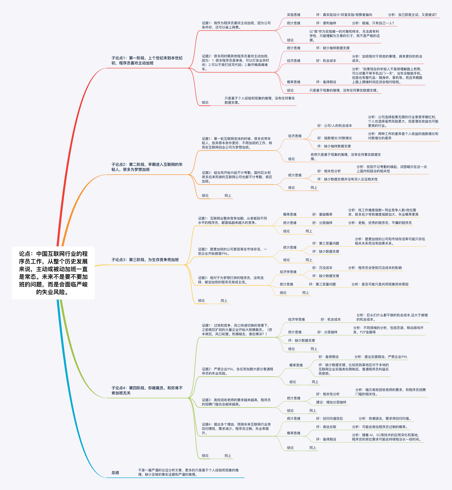

## 引言

> “996”工作制，即早 9 点到岗，工作到晚上 9 点，每周工作 6 天。2019 年 3 月 26 日，GitHub 用户发布了一个 “996.ICU” 的代码仓库，引发了人们广大关注。“996”工作制的讨论很快从 GitHub 蔓延到国内外各大社交平台，也从程序员发展到设计师等更加广泛的 IT 从业者人群。

> 不同人群纷纷表达了自己的看法。有人认为这是市场博弈的结果，一个愿打一个愿挨，无可厚非；有人认为大环境由供需关系决定，劳方、资方谁更稀缺，谁就更强势；有人认为如果 996 在做有意义的事情，那没有问题；有人认为 996 会挤占业余时间，让人们失去学习思考、感知创造的时间与精力……

996在特定的行业特别是IT和互联网行业，已经是一个默认的事实或者潜规则，以潜规则的方式存在是一个长期博弈的结果。一旦把潜规则变成明规则，一定会打破原有平衡。而本来希望可以增强大部分普通员工的利益的美好初衷不一定能变成现实，各位意见领袖，你究竟在为谁呐喊？各位看客，你又究竟在为谁摇旗？

偏中立的观点，相对会提供更多的视角和更高一层的意向性。

偏反对的观点，会有更多的先入为主，和所谓政治正确的倾向。

偏支持的观点，因为政治不正确，不好写。类似马云这样到了一定高度，已经不太在乎其他人意见的观点可以过了。而像曹大这样作为意见领袖的耿直Boy，应该会费点心思写一篇有态度、能代表某个角度的真实性的文章，所以本篇以[关于程序员的996，我们谈谈历史和逻辑](https://www.huxiu.com/article/291939.html)为案例，尝试进行初步论证分析。文章仅代表个人观点，不涉及任何针对案例原文作者的个人评价。

## 分析

首先是结论，文中论述并不能说服我，这不算一篇严谨的论证分析文章，更多的是基于自身经验和观点进行推论，缺少足够的事实证据和严谨的推理。

#### 原文论证拆解分析

详见下图：

####  

#### 原文“元反空”应用分析

- 元：996从来不是"万恶"的互联网企业主针对"无辜"的程序员们强加的一个枷锁。无论是从初期基于个人的生活和梦想的诉求，程序员主动要加班，还是后期为了适应日益加剧的市场竞争被迫加班，都是一个愿打一个愿挨的市场自愿行为。
- 反：假设996制度是不合理的，罪恶的，如果我们严禁996，可能会导致比现在更加严峻的后果。即大量的靠拼体力的互联网企业会消失，同时大量的普通程序员也会随之失业。
- 空：跳出996和加班的问题本身，更严峻的问题，可能是整个互联网行业的程序员们，在不远的将来会因为市场理性的回归，而无班可加，面临大量的失业风险。

## 构建

可以借鉴原文遵循时间脉络的分析框架，主要是增加足够可信的证据，并在论证使用中避免心智程序的偏差。当然有个比较大的挑战就是相关证据的收集。

#### 论点：中国互联网行业的996讨论可以休矣：让市场的归市场，法规的归政府，调节的归工会。

#### 子论点1：中国互联网企业是否要求员工加班，员工是否接受加班是市场行为；

##### 推论过程：

论证中国互联网业发展的不同时期，员工和企业加班的诉求都是正常的市场经济行为。

##### 证据1：互联网业早期员工愿意主动加班的**相关性分析**。

##### 证据采集：

找到相关的数据，包括早期调查问卷统计结果，问卷设计中主要因素包括员工：加班意愿(Y/N)，加班原因（更好的环境/为了梦想等）个人可支配的时间，婚姻状况，薪水收入水平，薪水增幅，上下班高峰的通勤时长，所在城市。

这些实验的抽样调查设计最好包括**分层抽样**，比如根据细分领域，游戏、电商、在线教育行业等；根据城市所在一线、二线、三线的分类。还应该包括**分层抽样**，比如低/中/高三个等级的程序员，可以参考**标准九**分类。

##### 预期结论：

和加班意愿正相关的因素包括个人更多支配的时间，未婚，收入相对其他行业高，薪水增幅，通勤时长，城市处于一二线。

##### 证据2：互联网业发展期员工接受加班的**相关性分析**。

##### 证据采集：

找到相关的数据，包括相关调查问卷统计结果，问卷设计中主要因素包括：

- 需：互联网企业数量、规模、投融资分析、上市情况等；
- 供：行业每年流入流出人才数量统计，潜在供应量(国内各高校的计算机相关专业开设的数量、招生人数、毕业生数量及历史变化数据)
- 其他因素：职位要求(包括技能、工作经验、学历等)。

#### 子论点2：政府通过制定合理的法律法规，可以在尊重市场规律的前提下保证劳资双方的享有公平合理的利益。

##### 推论过程：

通过分析中国和加班相关的法律法规的历史变迁以及现状，并且比对国内外相关学术论文，得出目前的法律法规是合理且能得到有效执行的结论。

##### 证据1：政府制定合理的相关法律法规，与确保劳资双方的利益最大化的**相关性分析**。

##### 证据采集：

可以查找有没有类似调查报告，政府通过制定不同严格程度的和加班有关的法规的规定，对于劳资双方利益的影响。相关因素包括：员工工资的变化，岗位需求的变化，失业率的变化，企业效益的变化等。

##### 预期结论：

过紧或者过松的关于加班的法律法规都会都不能确保劳资双方的利益最大化，政府不能过多的干预市场行为。当前我国相关的法律法规，是经过充分论证有效并且得到有效执行的。

#### 子论点3：工会在其中发挥了合理的调节作用。

##### 推论过程：

通过国内的互联网行业工会的历史沿革及现状分析、职责边界分析，并且比对国内外相关学术论文，得出国内互联网行业工会在调节劳资双方的利益过程中应该、而且可以起到重要的促进作用。

##### 证据1：

工会在国家层面的相关法律法规，比如劳动法、公司法的制定，以及公司层面协调劳资关系的过程中，起到了至关重要的作用。

##### 证据采集：

通过查找相关组织的的材料和论文得到相关的证据。

##### 预期结论：

工会是连接各级政府、企业、员工之间有效对话的长效机制，在调查报告中已经得到有效的论证。充分发挥工会的桥梁作用、提高工会的话语权，是促进劳资双方实现长期共赢的最优解。

加班指数预测分析：

在996.ICU里面设计调查问卷，比如邀请互联网企业CIO对于未来3~5年市场需求做预测，结合当前宏观经济和相关就业指数，比如投资人信心指数、行业景气指数、未来几年全国计算机专业相关的毕业生的数量的变化等，做相关分析。

### 补充说明：

基于政治正确的考虑，忽视工会在国内外的实际功能和可发挥作用的差异。

## 参考文献

- 开智学堂论证分析二期课件