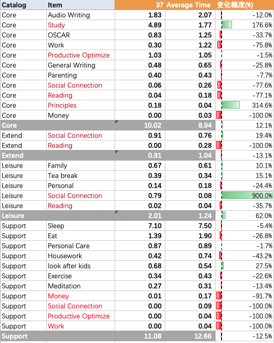

# 
# Review 
## Activity分析：

### Core：
增加了12.1%，主要是花比较多的时间在bp上，同时在principles上，因为采用新的更简单易行的方法，时间也有所增加

Audio Writing，稳定减少，效率提高的一个表现
Work，大幅度减少，重心切换到bp的学习上面
OSCAR 进一步减少，因为周五的游泳课，没有玩耍
Study，大幅度增加，准备bp的工作
Productive Optimize 
General Writing，继续减少，最近没有输出，只是保证正常的定期报告
Parenting，持平
Reading，减少，主要用来阅读paper
Social Connection 家人出去旅游，沟通时间减少
Money
Principles  得益于改进方法，可以降低最小行动，激发卡片写作

### Extend：

Reading 阅读时间大幅减少，主要是因为阅读bp Paper, 预计下周会有稳步回升
Study
Work
SocialConnection
productiveoptimize

### Leisure：
参加聚会活动，休闲时间增加
Family
Tea break
Personal
Social Connection数据失真，已经手工调整数据
Reading

### Support：

Sleep睡眠时间有所减少，通常都是晚睡导致，还可以进一步优化，尽量晚睡以后尽快睡觉，控制其他时间，比如社交时间
Eat
Personal Care
Housework
look after kids 预期调整的结果，增加27.5%
Exercise
Meditation
Money
Social Connection
Work
Productive Optimize

### Mutli Catalog activities：

Money相关事项没有进展
Reading读书时间大幅减少，预计下周会回升
Productive Optimize
Social Connection
Work工作时间大幅减少

## 图表分析：

### All Activities Daily

写作可以有进一步的降低空间

### Stacked Bar chart

### KPI 任务 雷达图

工作和学习时间此消彼长，锻炼的时间还是太少，需要提高

### 四大类任务 雷达图

Support 和 Core 此消彼长，主要是用来增加bp的学习

### Daily Item- Main

睡眠时间依然相对不稳定，预计下周会恢复正常，加强锻炼的时间，Intensive aw相对比较平缓
### Daily Item- Trifle

### Weekly Item
时间管理优化时间降低到正常水平，郑宅之宝时间增多，主要是因为阳生日，其他时间相对比较平缓，变化不大

# Plan ( H   minutes)
读书时间，需要稳步增加，另外增加运动时间，productive optimze 时间预计会增加，用于整合和简化现有工具。Study时间会减少。
# Changelog
* 20190909 V1.1 增加title
* 20190903 V1.0 初稿
## 

# 

